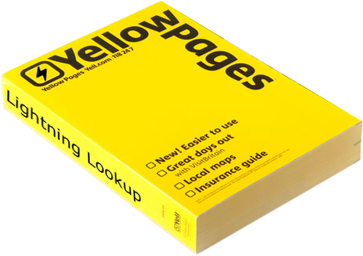

# CS-Yellow-pages
Discover, use, and contribute to our curated cybersecurity Yellow Pages. Access valuable links and resources. Use freely, but share improvements with the community. Let's build a safer online world together! 🛡️🔗 #CyberSecYellowPages

  
  
      
  Payloads And Related Tools - Exploits and Vulnerability Databases - Cryptography And Related  
  Cryptography And Related - MAN Pages and Cheat Sheets  
  MAN Pages and Cheat Sheets - Useful Online Tools

  

##
  

### __Payloads And Related Tools:__
[Online - Reverse Shell Generator](https://www.revshells.com/)

[php reverse shell Dot php](https://raw.githubusercontent.com/pentestmonkey/php-reverse-shell/master/php-reverse-shell.php)

[Windows PayLoads](https://github.com/swisskyrepo/PayloadsAllTheThings/blob/master/Methodology%20and%20Resources/Windows%20-%20Privilege%20Escalation.md)

[PayloadsAllTheThings](https://github.com/swisskyrepo/PayloadsAllTheThings/blob/master/Methodology%20and%20Resources/Reverse%20Shell%20Cheatsheet.md)

[Reverse Shell Cheat Sheet](https://pentestmonkey.net/cheat-sheet/shells/reverse-shell-cheat-sheet)
  
### __Exploits and Vulnerability Databases :__
[ExploitDB Database](https://www.exploit-db.com/)

[Rapid7 Database](https://www.rapid7.com/db/)

[OWASP Datebase](https://wiki.owasp.org/index.php/OWASP_favicon_database)

[Linux Kernel CVEs | All CVEs](https://www.linuxkernelcves.com/cves)

[GTFOBins](https://gtfobins.github.io/#)

[LOLBAS](https://lolbas-project.github.io/#)

[XSS Hunter](https://github.com/mandatoryprogrammer/xsshunter-express)

[XSS Polyglot](https://github.com/0xsobky/HackVault/wiki/Unleashing-an-Ultimate-XSS-Polyglot)

[payloads and bypass](https://github.com/swisskyrepo/PayloadsAllTheThings)
  
### __Cryptography And Related:__
[Base64 Decode](https://www.base64decode.org/)

[Base64 Encode](https://www.base64encode.org/)

[CyberChef](https://gchq.github.io/CyberChef/)

[CrackStation - Online Password Hash Cracking - MD5, SHA1, Linux, Rainbow Tables, etc.](https://crackstation.net/)
  
### __MAN Pages and Cheat Sheets:__
[Vim Cheat Sheet](https://vim.rtorr.com/)

[MSFVenom](https://book.hacktricks.xyz/generic-methodologies-and-resources/shells/msfvenom)

[Gobuster CheatSheet](https://3os.org/penetration-testing/cheatsheets/gobuster-cheatsheet/)

[Nmap Cheat Sheet](https://www.comparitech.com/net-admin/nmap-nessus-cheat-sheet/)

[nmap man page](https://linux.die.net/man/1/nmap)

[Nmap Script](https://tryhackme.com/room/nmap04)
  
### __Useful Online Tools:__
[SecLists](https://github.com/danielmiessler/SecLists/tree/master)

[dns recon](https://dnsdumpster.com/)

[Shodan Search Engine](https://www.shodan.io/)

[Home - KYCnot.me](https://kycnot.me/)

[NVD - CVSS v3 Calculator](https://nvd.nist.gov/vuln-metrics/cvss/v3-calculator)

[Find out what websites are built with - Wappalyzer](https://www.wappalyzer.com/)

[Internet Archive: Wayback Machine](https://archive.org/web/)
